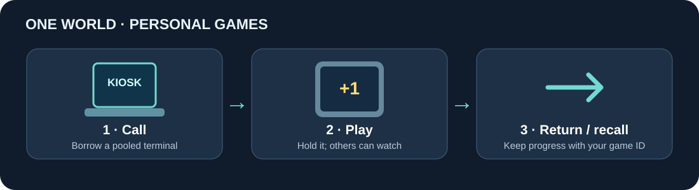
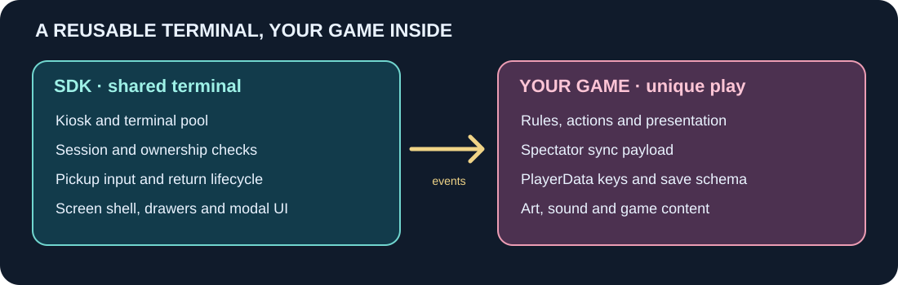

# VRChat Pocket Game SDK

**Put a personal, handheld game in a shared VRChat world.** Players call a terminal from a kiosk, pick it up, play, put it away, and call it back. The SDK handles the terminal lifecycle; you build the game that runs on its screen.

[日本語](README.ja.md) · [VPM repository](https://tenteeeee.github.io/vpm-repos/) · [Package documentation](Packages/com.tentee.vrc-pocket-game/README.md)

The included **counter game is a small working example**, not the only kind of game you can make. The SDK provides a reusable handheld shell, pickup input, session and ownership checks, and shared UI. Your game provides its rules, content, synced spectator data, and PlayerData save format.

## Try the counter sample

1. Create a **VRChat Worlds** project with Unity **2022.3.22f1** and VRChat Worlds **3.10.5 or later**. Import **Window > TextMeshPro > Import TMP Essential Resources**.
2. Add `https://tenteeeee.github.io/vpm-repos/index.json` as a custom VPM repository in VRChat Creator Companion, then add **VRChat Pocket Game SDK** to the project.
3. Open a world scene and choose **Tools > VRC Pocket Game SDK > Install Counter Sample**. The installer adds a kiosk and two pooled terminals to the current scene.
4. Install ClientSim for local testing and enter Play mode. Interact with the kiosk to call a terminal, then pick it up and press **+1** or use Pickup Use. Choose **Settings > Save & stow**, then call a terminal again to see the saved count.

The installer generates Udon assets under `Assets/VrcPocketGameGenerated`; it does not modify files under `Packages`. The sample also demonstrates a spectator view, an overlay drawer, a separate world-space drawer, and modal input blocking. See the [package README](Packages/com.tentee.vrc-pocket-game/README.md) and [validation notes](Packages/com.tentee.vrc-pocket-game/docs/VALIDATION.md) for details.

## Build your own game

Start from the [counter game and installer](Packages/com.tentee.vrc-pocket-game/docs/EXTENDING.md) as a reference. Create a separate game runtime assembly, build terminals with `PocketGameTerminalBuilder` and their UI with `PocketGameUiBuilder`, then connect your game behavior to the terminal session. `PocketGameTerminalProfile` lets you adjust the physical shell, screen, pickup and drawer layout.

Use `PocketGameBehaviour` for the common terminal event hooks, or implement the event contract yourself. Check `CanUseGameInput()` in every game input method, including methods called directly by UI buttons. Keep saves under a stable game ID such as `author.game.v1`; a pool slot is a physical terminal, not a save identity. The [extension guide](Packages/com.tentee.vrc-pocket-game/docs/EXTENDING.md) walks through assembly setup, installer wiring, events, syncing and validation.

## For contributors

The package lives in [`Packages/com.tentee.vrc-pocket-game/`](Packages/com.tentee.vrc-pocket-game/). Open this repository as a Unity 2022.3.22f1 project, install VRChat Worlds 3.10.5 or later through VCC, import TMP Essential Resources, and run `python -X utf8 Tools/verify-package.py` before committing. See the [architecture](Packages/com.tentee.vrc-pocket-game/docs/ARCHITECTURE.md) and [package boundaries](Packages/com.tentee.vrc-pocket-game/docs/BOUNDARY.md).

### Releasing

1. Update `CHANGELOG.md`, then merge the change. The release workflow reads the version from the tag, so do not edit `package.json` for a release.
2. Push a semantic version tag such as `x.x.x` or `vx.x.x`; the workflow writes that version into the packaged VPM metadata, verifies it, creates a GitHub release, and attaches the package files.
3. Or run **Release VPM package** manually from a version tag to backfill an older release. Branch runs are limited to dry runs.
4. Set `dry_run` to build and verify the files without publishing.
5. `VPM_REPOS_TOKEN` is optional and lets the workflow trigger the VPM listing rebuild.
6. Without it, run **Build Repo Listing** manually in the `TenteEEEE/vpm-repos` Actions tab.
